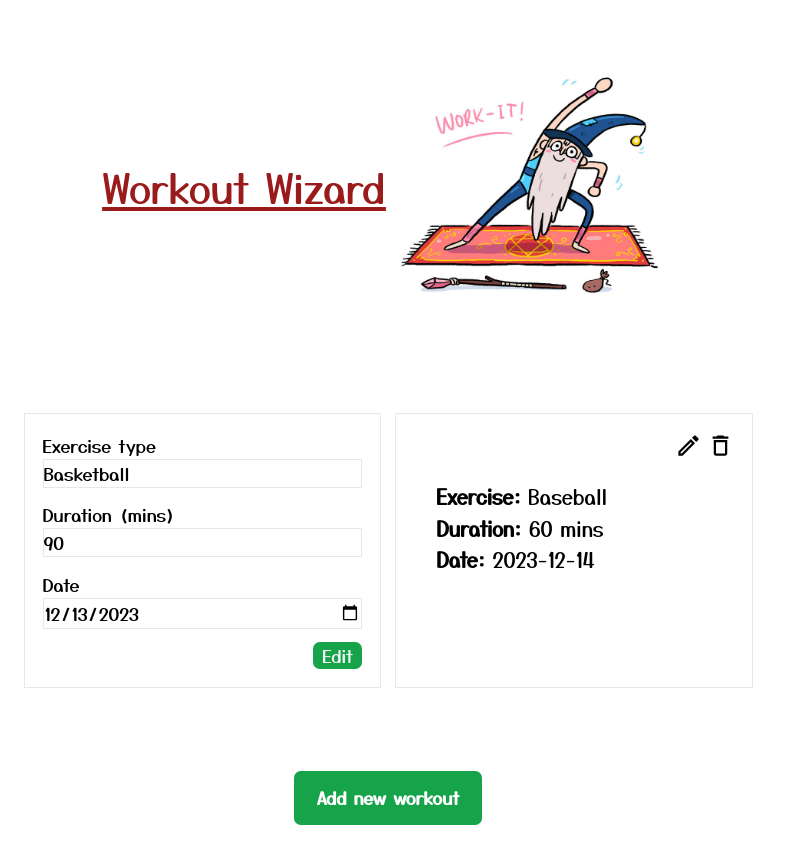

# Fitness Tracker

  

## Overview

A full-stack fitness tracker project to sharpen my development skills. Built with Express.js for the backend, Mongoose for MongoDB, and React for an interactive frontend.

## Features

- **User-Friendly Interface:** Crafted with React to provide a seamless and engaging experience.
- **Fitness Tracking:** Log exercise types, durations, and dates to monitor fitness routines.

## Technologies Used

- **Express.js:** Backend framework for a robust server.
- **Mongoose:** Object data modeling library for MongoDB.
- **React:** Frontend library for dynamic and responsive UI.

## Getting Started

1. Clone the repository: `git clone https://github.com/your-username/fitness-tracker.git`
2. Navigate to the project folder: `cd fitness-tracker`
3. Install dependencies: `npm install`
4. Start the development server: `npm start`
